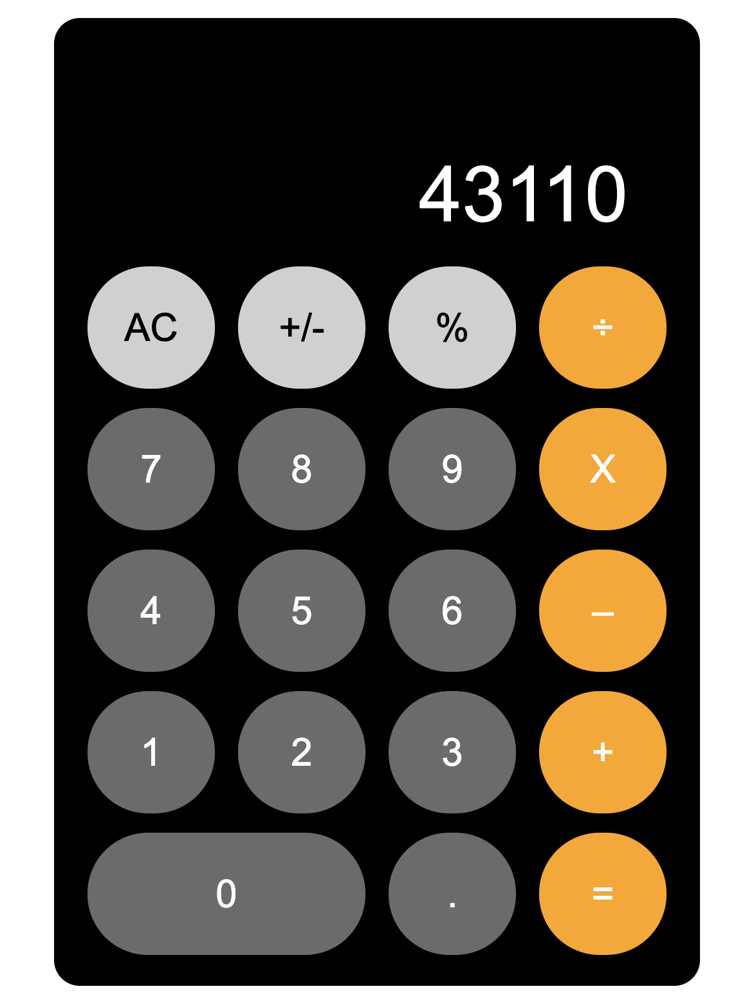

# Calculator

My attempt at creating a functioning calculator inspired in both design and function by Apple's basic iOS calculator. This project uses HTML and CSS for design and Javascript for enabling functionality and interactivity. All functions ***should*** work correctly, however some bugs may still exist as I continue to optimize and tweak the project.

This project is part of The Odin Project's Fundamentals curriculum: (https://www.theodinproject.com/courses/foundations/lessons/calculator).

